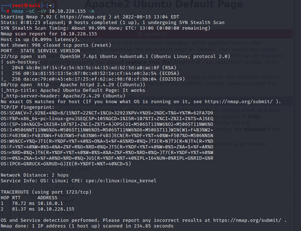
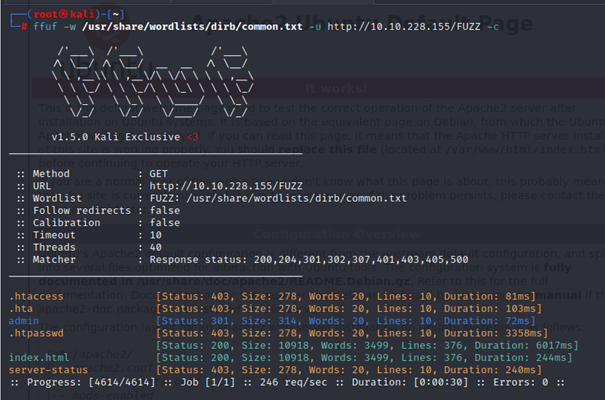
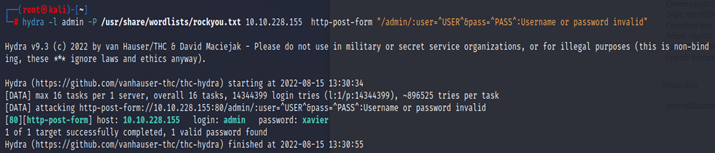
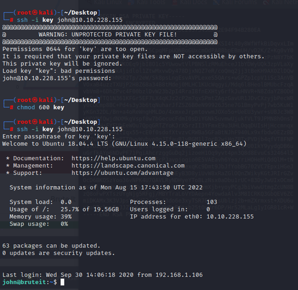
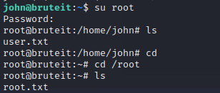

# TryHackMe: Brute-It Write-Up
> **Herkese merhabalar bu yazımda TryHackMe: Brute-It CTF'inin nasıl çözüldüğünü anlatacağım.**

- Nap ve Ffuf çalıştırdım. Ffuf daha hızlı olduğundan gobuster yerine Ffuf kullanıyorum. Nmap sonuçlarına göre ssh’ın açık olduğunu gördüm. Ayrıca /admin sayfasını buldum.

--
- Böyle bir login sayfasıyla karşılaştım:

--
- Kaynak koduna baktığımda John adlı bir kullanıcı olduğunu fark ettim. Ve kullanıcı adının admin olduğunu öğrendim.

--
- Elimizde kullanıcı adı ve bir login sayfası var. Aklıma hemen hydra ile brute force yapmak geldi.

--
- Kullanıcı adı ve şifreyi girdikten sonra bu sayfayla karşılaştım:

--
- John aracı ile verilen RSA private keyi crackledim.

--
- Ssh ile john kullanıcısına bağlanmayı denedim. İlk denememde “UNPROTECTED PRIVATE KEY FILE” uyarısı aldım. Chmod ile private key dosyasına yetki verdim ve yeniden ssh ile bağlanmayı denedim. John ile bulduğum şifreyi girdim ve bağlandım.

--
Sudo -l komutu ile root olarak çalıştırabileceklerimize bakılır ve cat komutunun çalıştığı fark edilir. “sudo cat /etc/shadow” komutu kullanılır.

--
Root adlı kullanıcının hashini bir dosyaya atıyoruz ve john kullanarak bunu crackliyoruz.

--
Şifreye ulaştık root kullanıcısı olarak giriş yapıyoruz.

